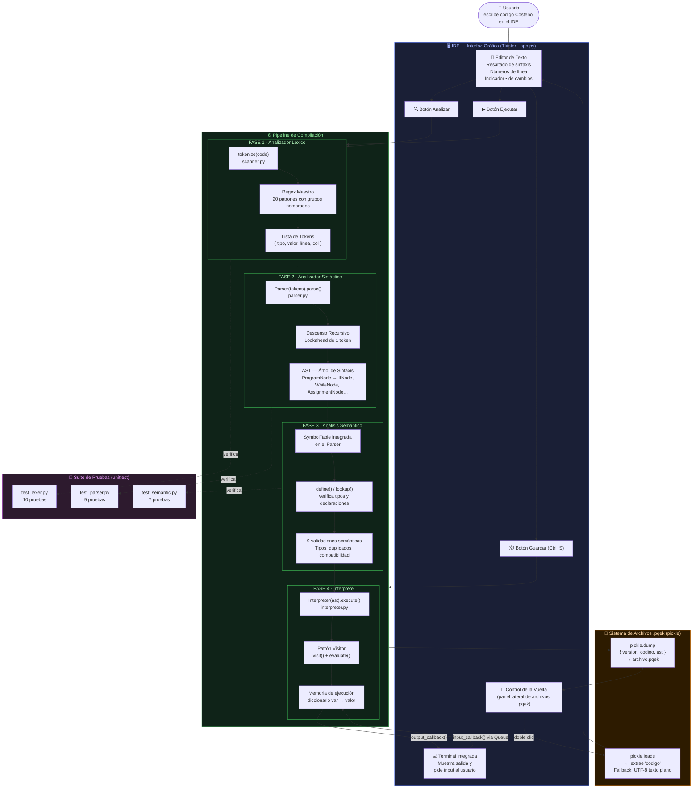

# Compilador "COSTEÑOL" 🦀

Un IDE y compilador educativo desarrollado en **Python** con **Tkinter**, diseñado para analizar léxica, sintáctica y semánticamente el lenguaje **"Costeñol"**, un lenguaje de programación basado en el dialecto de la costa caribe colombiana. Este proyecto incluye un motor de ejecución interactivo, sistema de empaquetado y un entorno de desarrollo completo.

---

## 📖 ¿De qué trata el proyecto?

El proyecto es un lenguaje de programación esotérico y educativo que busca acercar los conceptos de diseño de compiladores a un entorno más coloquial y divertido. Proporciona su propia sintaxis, analizador léxico, analizador sintáctico (parser), validador semántico e intérprete. Todo empaquetado dentro de un IDE con interfaz gráfica.

### Características Principales:
- **IDE Integrado**: Interfaz gráfica con editor de texto, terminal interactiva y administrador de archivos.
- **Dialecto Costeñol**: Mensajes de error, éxito y operaciones utilizan expresiones típicas costeñas.
- **Control de Flujo Completo**: Soporte para condicionales (`Si`, `Sino`) y bucles (`Mientras`).
- **Tipado Fuerte**: Validación semántica para operaciones y asignaciones (e.g. `Entero`, `Real`, `Texto`, `Logico`).
- **Sistema de Archivos Propios (.pqek)**: Guarda tanto el código fuente como los árboles de sintaxis serializados.
- **Terminal de Alto Rendimiento**: Terminal incorporada con auto-limpieza, scroll inteligente y entrada continua.
- **Comentarios**: Soporte para comentarios en el código mediante `//`.


---

## 🔬 Arquitectura y Flujo de Funcionamiento

El compilador de **"Costeñol"** procesa y ejecuta las instrucciones estructuradamente a través de varias fases clave:



> **Nota:** Para una explicación profunda sobre el diseño técnico, patrones y gramática completa, consulta el documento [SUSTENTACION_TECNICA.md](docs/SUSTENTACION_TECNICA.md).

---

## 🗂️ Estructura del Proyecto


```text
compilator_costeñol/
├── packages/               # Archivos .pqek (Código + AST serializado)
├── src/
│   ├── gui/                # IDE con Terminal y "Control de la Vuelta"
│   ├── lexer/              # Lexer con soporte para comentarios y comparadores
│   ├── parser/             # Parser con soporte para Si/Mientras
│   ├── interpreter/        # Motor de ejecución (Visita el AST)
│   └── main.py             # Punto de entrada principal
├── tests/                  # Pruebas unitarias para validar las fases de compilación
├── docs/                   
│   └── SUSTENTACION_TECNICA.md # Documento técnico completo del compilador
└── README.md
```

---

## ⚙️ Instalación y Configuración

Para utilizar o modificar el compilador en tu propia máquina, sigue estos pasos:

### 1. Requisitos Previos
- Tener instalado **Python 3.8** o superior.
- (Opcional pero recomendado) Crear un entorno virtual.

### 2. Clonar el Repositorio
```bash
git clone https://github.com/Blazkull/compilator_coste-ol.git
cd compilator_coste-ol
```

### 3. Instalar Dependencias
Instala los paquetes necesarios definados en el proyecto:
```bash
pip install -r requirements.txt
```

### 4. Ejecutar el Compilador (IDE)
Para abrir la interfaz gráfica y comenzar a programar en Costeñol, ejecuta:
```bash
python src/main.py
```

---

## 📚 Gramática y Uso del Lenguaje

### Variables y Asignación
El lenguaje requiere definir el tipo de variable antes de usarla.
```text
edad Entero;
nombre Texto;
es_mayor Logico;

edad = 25;
nombre = "Juan";
```

### Entrada y Salida
Interactúa con la terminal del IDE usando comandos costeños:
```text
// Imprimir en pantalla
Mensaje.Texto("Habla, mi llave!");

// Leer datos desde la terminal
Mensaje.Texto("¿Qué edad tienes?");
edad = Captura.Entero();
```

### Concatenación y Operadores
- **Suma de números**: Se usa `+`.
- **Concatenación de texto**: Se usa la coma `,`.
```text
Mensaje.Texto("Tu edad es ", edad);
```

### Control de Flujo (Condicionales)
Las condiciones en `Si` y `Mientras` deben evaluar a un valor `Logico`.
```text
Si (edad >= 18) {
    Mensaje.Texto("Pasa, mi llave, eres mayor.");
} Sino {
    Mensaje.Texto("Pa la casa, tas pelao.");
}
```

### Ciclos (Mientras)
```text
limite Entero;
i Entero;

limite = 5;
i = 1;

Mientras (i <= limite) {
    Mensaje.Texto("Contando: ", i);
    i = i + 1;
}
```

---

## 🧪 Pruebas Unitarias

El proyecto viene con su suite de pruebas para asegurar la estabilidad del compilador (fases léxicas, sintácticas y semánticas):
```bash
python run_tests.py
```

---

## 👨‍💻 Desarrolladores y Colaboradores

Este proyecto fue ideado y desarrollado con mucho esmero y sabrosura costeña por:

- **[Jhoan Acosta](https://github.com/Blazkull)**
- **[Rafael Jimenez](https://github.com/Rafael-Jimenez)**

> Puedes ver el registro completo de colaboraciones directamente en los [Contributors del Proyecto](https://github.com/Blazkull/compilator_coste-ol/graphs/contributors).
