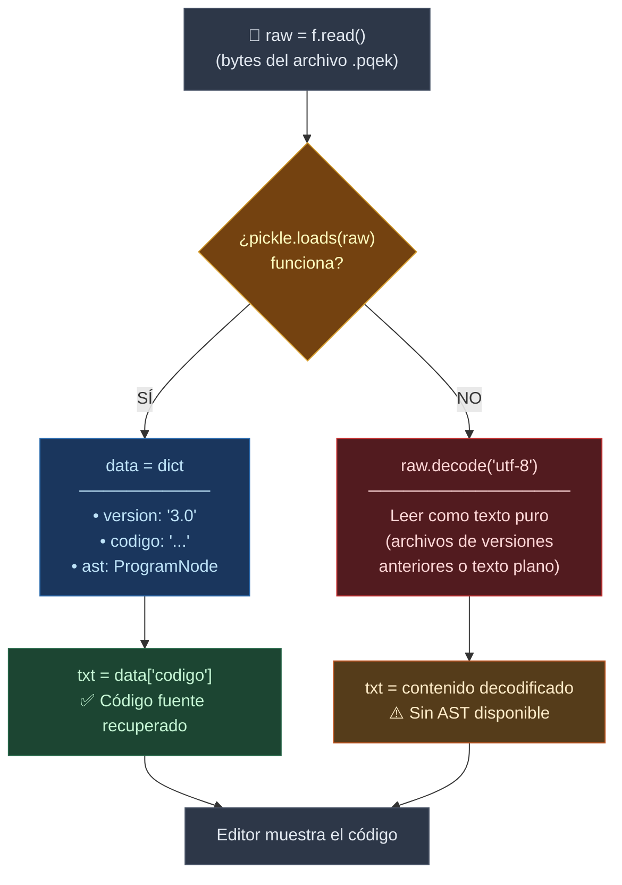
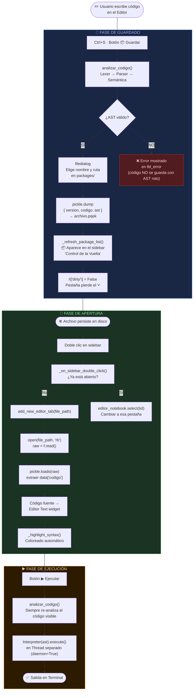
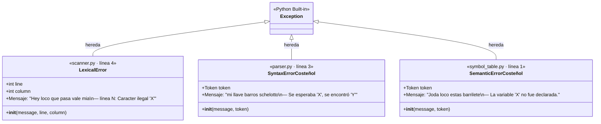
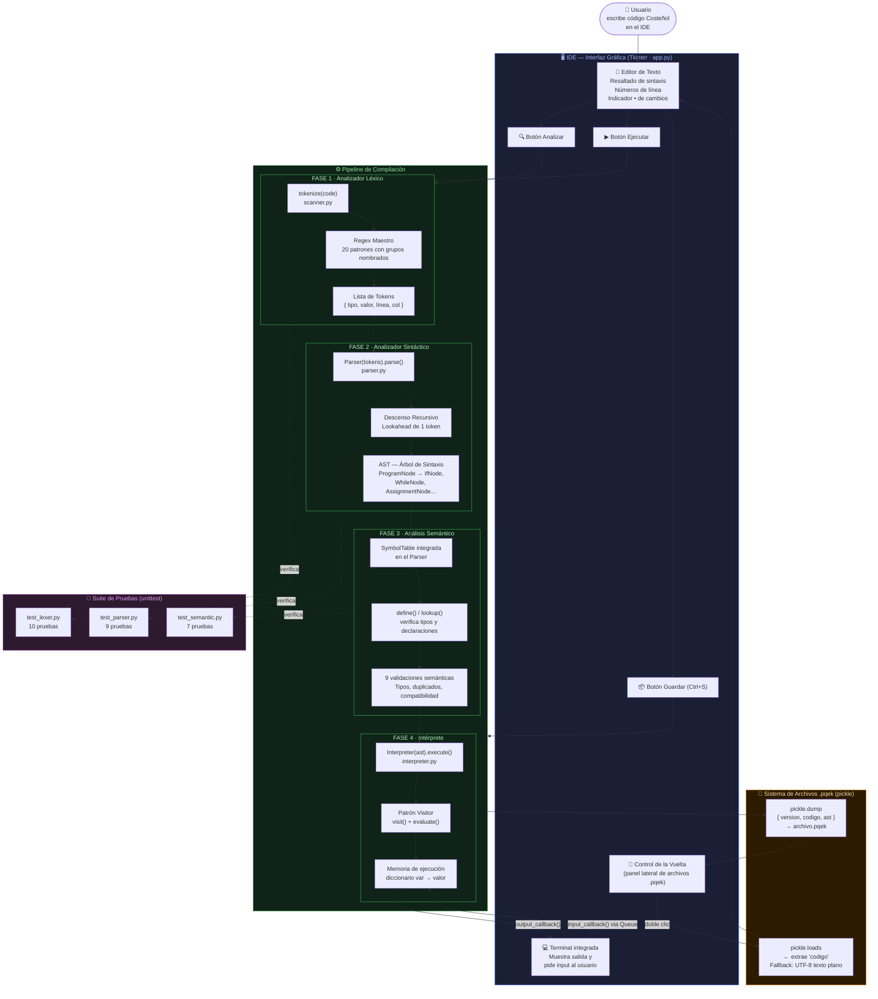

# 🦀 Sustentación Técnica — Compilador "Costeñol"

> **Documento para sustentación académica**  
> Autores: Jhoan Acosta · Rafael Jimenez  
> Tecnología base: Python 3.8+ · Tkinter · `re` (expresiones regulares) · `unittest`

---

## Tabla de Contenidos

1. [¿Qué es el Compilador Costeñol?](#1-qué-es-el-compilador-costeñol)
2. [Arquitectura General del Sistema](#2-arquitectura-general-del-sistema)
3. [Fase 1 — Analizador Léxico (Lexer)](#3-fase-1--analizador-léxico-lexer)
4. [Fase 2 — Analizador Sintáctico (Parser) y el AST](#4-fase-2--analizador-sintáctico-parser-y-el-ast)
5. [Fase 3 — Análisis Semántico (Tabla de Símbolos)](#5-fase-3--análisis-semántico-tabla-de-símbolos)
6. [Fase 4 — Intérprete (Motor de Ejecución)](#6-fase-4--intérprete-motor-de-ejecución)
7. [La Interfaz Gráfica (IDE)](#7-la-interfaz-gráfica-ide)
8. [Sistema de Empaquetado `.pqek`](#8-sistema-de-empaquetado-pqek)
9. [Gramática Formal del Lenguaje](#9-gramática-formal-del-lenguaje)
10. [Validaciones y Manejo de Errores](#10-validaciones-y-manejo-de-errores)
11. [Suite de Pruebas Unitarias](#11-suite-de-pruebas-unitarias)
12. [Flujo Completo de Ejecución (Ejemplo Real)](#12-flujo-completo-de-ejecución-ejemplo-real)

---

## 1. ¿Qué es el Compilador Costeñol?

El **Compilador Costeñol** es un proyecto académico que implementa de cero las cuatro fases clásicas de un compilador/intérprete: análisis léxico, análisis sintáctico, análisis semántico y ejecución. Todo está escrito en **Python puro** sin usar generadores de compiladores externos como ANTLR, PLY o Lark — cada componente fue construido a mano.

### Características únicas del lenguaje

| Característica | Descripción |
|---|---|
| **Dialecto cultural** | La sintaxis usa palabras del español caribe colombiano (`Si`, `Sino`, `Mientras`, `Mensaje`, `Captura`) |
| **Tipado fuerte** | Toda variable debe declararse con su tipo antes de usarse |
| **Mensajes de error costeños** | Los errores usan frases como `"Hey loco que pasa vale mia"` o `"Joda loco estas barrilete"` |
| **Formato numérico local** | Los números reales usan coma decimal (`3,14`) en lugar de punto |
| **Concatenación con coma** | Las cadenas de texto se unen con `,` no con `+` |
| **Empaquetado propio** | Los programas se guardan en archivos `.pqek` con código fuente + AST serializado |

---

## 2. Arquitectura General del Sistema

El proyecto está organizado como un **monorepo de módulos Python**, donde cada fase del compilador vive en su propio paquete:

```
compilator_costeñol/
├── src/
│   ├── main.py               ← Punto de entrada principal
│   ├── lexer/
│   │   ├── tokens.py         ← Definición de tipos y Regex maestro
│   │   └── scanner.py        ← Tokenizador (recorre el código fuente)
│   ├── parser/
│   │   └── parser.py         ← Parser + definición de todos los nodos AST
│   ├── semantic/
│   │   └── symbol_table.py   ← Tabla de Símbolos y error semántico
│   ├── interpreter/
│   │   └── interpreter.py    ← Motor de ejecución (patrón Visitor)
│   └── gui/
│       └── app.py            ← IDE completo con Tkinter
├── packages/                 ← Programas guardados (.pqek)
├── tests/
│   ├── test_lexer.py
│   ├── test_parser.py
│   └── test_semantic.py
└── run_tests.py              ← Corredor de pruebas centralizado
```

### Diagrama de flujo del compilador

```
┌──────────────────┐
│  Código fuente   │  (texto escrito en el IDE)
│  (.pqek / texto) │
└────────┬─────────┘
         │
         ▼
┌──────────────────────────────┐
│   FASE 1: LEXER              │  src/lexer/scanner.py
│   tokenize(code) → [Token]   │  Convierte texto en tokens
└────────┬─────────────────────┘
         │ Lista de Tokens
         ▼
┌──────────────────────────────┐
│   FASE 2: PARSER             │  src/parser/parser.py
│   Parser(tokens).parse()     │  Valida gramática + construye AST
│   ↳ También hace semántica   │
└────────┬─────────────────────┘
         │ AST (árbol de nodos)
         ▼
┌──────────────────────────────┐
│   FASE 3: SEMÁNTICA          │  src/semantic/symbol_table.py
│   SymbolTable.define/lookup  │  Integrada dentro del Parser
└────────┬─────────────────────┘
         │ AST validado
         ▼
┌──────────────────────────────┐
│   FASE 4: INTÉRPRETE         │  src/interpreter/interpreter.py
│   Interpreter.execute(ast)   │  Visita cada nodo y lo ejecuta
└────────┬─────────────────────┘
         │ Salida en tiempo real
         ▼
┌──────────────────────────────┐
│   TERMINAL / GUI             │  src/gui/app.py
│   output_callback(mensaje)   │  Muestra resultados en la pantalla
└──────────────────────────────┘
```

---

## 3. Fase 1 — Analizador Léxico (Lexer)

**Archivos:** [`src/lexer/tokens.py`](../src/lexer/tokens.py) · [`src/lexer/scanner.py`](../src/lexer/scanner.py)

El analizador léxico es el primer componente que procesa el código fuente. Su trabajo es convertir una cadena de texto plano en una secuencia de **Tokens**, que son las unidades mínimas con significado del lenguaje.

### 3.1 Definición de Tokens — `tokens.py`

Se usa el módulo estándar `re` de Python y un `Enum` para definir todos los tipos de tokens del lenguaje:

```python
# src/lexer/tokens.py — Líneas 4 a 24
class TokenType(Enum):
    COMENTARIO         = r'//.*'
    TIPO_DATO          = r'\b(Texto|Entero|Real|Logico)\b'
    COMANDO_IO         = r'\b(Captura|Mensaje)\b'
    CONTROL            = r'\b(Si|Sino|Mientras)\b'
    BOOLEANO           = r'\b(Verdad|Mentira)\b'
    IDENTIFICADOR      = r'\b[a-zA-Z_][a-zA-Z0-9_]*\b'
    NUMERO_REAL        = r'\b\d+,\d+\b'       # <-- Coma decimal costeña!
    NUMERO_ENTERO      = r'\b\d+\b'
    CADENA_TEXTO       = r'"[^"]*"'
    OPERADOR_ASIGNACION= r'='
    COMPARADOR         = r'==|!=|<=|>=|<|>'
    OPERADOR_ARITMETICO= r'[\+\-\*/]'
    SEPARADOR          = r'\.'
    DELIMITADOR_FIN    = r';'
    PARENTESIS_ABRE    = r'\('
    PARENTESIS_CIERRA  = r'\)'
    LLAVE_ABRE         = r'\{'
    LLAVE_CIERRA       = r'\}'
    COMA               = r','
    ESPACIOS           = r'\s+'
```

#### ¿Por qué el orden importa?

El orden de la lista `TOKEN_REGEX` (líneas 27–48 de `tokens.py`) es **crítico**. El motor de regex usa alternancia (`|`) y prueba los patrones de izquierda a derecha. Por ejemplo:

- `COMENTARIO` va primero → evita que `//` sea interpretado como dos operadores `/`
- `COMPARADOR` (`==`) va antes que `OPERADOR_ASIGNACION` (`=`) → evita que `==` sea leído como dos signos `=` separados
- `NUMERO_REAL` va antes que `NUMERO_ENTERO` → si el lexer ve `3,14`, debe reconocer el número completo antes de leer solo el `3`
- Las palabras clave (`TIPO_DATO`, `CONTROL`, `BOOLEANO`) van antes que `IDENTIFICADOR` → para que `Si` no sea tratado como un identificador genérico

```python
# src/lexer/tokens.py — Líneas 50-51
# El "Regex Maestro": une todos los patrones con grupos nombrados
MASTER_REGEX = re.compile(
    '|'.join(f'(?P<{name}>{pattern})' for name, pattern in TOKEN_REGEX)
)
```

Este **Regex Maestro** es una sola expresión regular gigante con **grupos de captura nombrados** (`(?P<NOMBRE>patron)`). Cuando hace match, `match.lastgroup` devuelve el nombre del tipo de token que coincidió.

### 3.2 El Escáner — `scanner.py`

```python
# src/lexer/scanner.py — Líneas 4-8 (error léxico costeño)
class LexicalError(Exception):
    def __init__(self, message, line, column):
        super().__init__(f"Hey loco que pasa vale mia — línea {line}: {message}")
        self.line = line
        self.column = column
```

```python
# src/lexer/scanner.py — Líneas 10-18 (clase Token)
class Token:
    def __init__(self, type_name, value, line, column):
        self.type = type_name   # Tipo: "IDENTIFICADOR", "TIPO_DATO", etc.
        self.value = value      # Valor literal: "nombre", "Entero", etc.
        self.line = line        # Número de línea en el código fuente
        self.column = column    # Columna dentro de esa línea
```

Cada `Token` guarda su **tipo**, **valor**, **línea** y **columna**. Esto es fundamental para los mensajes de error precisos — el compilador puede señalar exactamente dónde está el problema.

```python
# src/lexer/scanner.py — Líneas 20-52 (función principal tokenize)
def tokenize(code: str):
    tokens = []
    line_num = 1
    line_start = 0
    position = 0
    length = len(code)
    
    while position < length:
        match = MASTER_REGEX.match(code, position)  # Intento de match en posición actual
        if match:
            type_name = match.lastgroup
            value = match.group(type_name)
            column = position - line_start + 1
            
            if type_name != 'ESPACIOS':                # Los espacios se descartan
                tokens.append(Token(type_name, value, line_num, column))
            elif '\n' in value:
                # Si hay saltos de línea en los espacios, actualizar contador
                line_num += value.count('\n')
                line_start = position + value.rfind('\n') + 1
                
            position = match.end()  # Avanzar al siguiente token
        else:
            # Carácter no reconocido → error léxico
            illegal_char = code[position]
            raise LexicalError(f"Caracter ilegal '{illegal_char}'", line_num, column)
    
    return tokens
```

**Puntos clave del algoritmo:**
- **Avance lineal**: el bucle `while` avanza `position` hasta el final del código
- **Match en posición**: `MASTER_REGEX.match(code, position)` ancla el match en la posición actual, no busca en todo el texto
- **Descarte de espacios**: los `ESPACIOS` se procesan para contar líneas pero no se agregan a la lista de tokens
- **Tracking de líneas**: cuando un espacio contiene `\n`, se actualiza `line_num` y `line_start` para calcular columnas correctas en la siguiente línea
- **Fallo explícito**: si no hay match, el carácter es ilegal y se lanza `LexicalError`

### 3.3 Ejemplo de tokenización

Entrada: `edad Entero;`

| Posición | Token | Tipo | Línea | Col |
|---|---|---|---|---|
| 0 | `edad` | `IDENTIFICADOR` | 1 | 1 |
| 5 | `Entero` | `TIPO_DATO` | 1 | 6 |
| 11 | `;` | `DELIMITADOR_FIN` | 1 | 12 |

---

## 4. Fase 2 — Analizador Sintáctico (Parser) y el AST

**Archivo:** [`src/parser/parser.py`](../src/parser/parser.py)

El Parser recibe la lista de tokens del Lexer y verifica que su orden sea gramaticalmente correcto según las reglas del lenguaje. Su salida es un **Árbol de Sintaxis Abstracta (AST)** — una representación en memoria del programa.

### 4.1 Tipos de nodos del AST

Todos los nodos heredan de `ASTNode` (línea 12). Cada tipo de construcción del lenguaje tiene su propio nodo:

```python
# src/parser/parser.py — Líneas 12-75
class ASTNode: pass

class ProgramNode(ASTNode):       # Nodo raíz: contiene todas las sentencias
    def __init__(self, statements): ...

class DeclarationNode(ASTNode):   # "nombre Texto;"
    def __init__(self, name, var_type): ...

class AssignmentNode(ASTNode):    # "edad = 25;"
    def __init__(self, name, value_node): ...

class ConcatenationNode(ASTNode): # "saludo, nombre" (unión de textos)
    def __init__(self, nodes): ...

class CaptureNode(ASTNode):       # "edad = Captura.Entero();"
    def __init__(self, name, var_type): ...

class MessageNode(ASTNode):       # "Mensaje.Texto("Hola");"
    def __init__(self, msg_type, arguments): ...

class BinaryOpNode(ASTNode):      # "a + b", "a * b", etc.
    def __init__(self, left, op, right, result_type): ...

class LiteralNode(ASTNode):       # Un valor literal: 5, "hola", Verdad
    def __init__(self, value, val_type): ...

class VariableNode(ASTNode):      # Referencia a variable existente
    def __init__(self, name, var_type): ...

class IfNode(ASTNode):            # "Si (...) { } Sino { }"
    def __init__(self, condition, then_statements, else_statements=None): ...

class WhileNode(ASTNode):         # "Mientras (...) { }"
    def __init__(self, condition, body_statements): ...

class ComparisonNode(ASTNode):    # "a == b", "a > b", etc.
    def __init__(self, left, op, right): ...
```

### 4.2 Estructura del Parser — Descenso Recursivo

El Parser usa la técnica de **Análisis por Descenso Recursivo** (Recursive Descent Parsing). Cada regla gramatical tiene su propio método:

```python
# src/parser/parser.py — Líneas 77-91
class Parser:
    def __init__(self, tokens):
        self.tokens = tokens
        self.current_index = 0
        self.current_token = self.tokens[0] if self.tokens else None
        self.symtab = SymbolTable()   # ← La tabla de símbolos vive aquí
```

```python
# src/parser/parser.py — Líneas 84-104
def advance(self):
    """Avanza al siguiente token en la lista."""
    self.current_index += 1
    if self.current_index < len(self.tokens):
        self.current_token = self.tokens[self.current_index]
    else:
        self.current_token = None   # EOF

def match(self, expected_type):
    """Consume el token actual si es del tipo esperado, si no lanza error."""
    token = self.current_token
    if self.current_token and self.current_token.type == expected_type:
        self.advance()
        return token
    else:
        raise SyntaxErrorCosteñol(
            f"mi llave barros schelotto — Se esperaba '{expected_type}', "
            f"pero se encontró '{actual_type}' ('{val}').",
            self.current_token
        )
```

### 4.3 Jerarquía de Análisis (Reglas Gramaticales)

El parser implementa una jerarquía de métodos que respeta la **precedencia de operadores**:

```
parse()                    ← Programa completo
  └─ parse_statement()     ← Decide qué sentencia analizar
       ├─ parse_declaracion()         → [ID] [TIPO];
       ├─ parse_asignacion_o_captura() → [ID] = [expr | Captura];
       ├─ parse_mensaje()             → Mensaje.[TIPO]([args]);
       ├─ parse_if()                  → Si ([cond]) { } [Sino { }]
       └─ parse_while()              → Mientras ([cond]) { }

parse_expresion_logica()   ← Comparaciones: expr OP expr
  └─ parse_expresion()     ← Suma/Resta: factor +/- factor
       └─ parse_factor()   ← Multiplicación/División: termino */÷ termino
            └─ parse_termino() ← Átomo: literal | variable | (expresión)
```

Esta jerarquía asegura la correcta **precedencia aritmética**: `*` y `/` se evalúan antes que `+` y `-`, porque `parse_factor` se llama dentro de `parse_expresion`.

### 4.4 Análisis de una sentencia `Si`

```python
# src/parser/parser.py — Líneas 174-188
def parse_if(self):
    """Regla: Si ( [ExpLogica] ) { [Cuerpo] } [Sino { [Cuerpo] }]"""
    self.match('CONTROL')          # Consume el token "Si"
    self.match('PARENTESIS_ABRE')  # Consume "("
    condition = self.parse_expresion_logica()  # Analiza la condición
    self.match('PARENTESIS_CIERRA') # Consume ")"
    
    then_branch = self.parse_block()  # Analiza el bloque { }
    else_branch = None
    
    # El "Sino" es opcional: solo se parsea si el siguiente token es "Sino"
    if (self.current_token and 
        self.current_token.type == 'CONTROL' and 
        self.current_token.value == 'Sino'):
        self.match('CONTROL')
        else_branch = self.parse_block()
        
    return IfNode(condition, then_branch, else_branch)
```

### 4.5 Lookahead de 1 Token

El parser usa **lookahead de 1 token** para decidir qué tipo de sentencia viene al ver un `IDENTIFICADOR`:

```python
# src/parser/parser.py — Líneas 150-167
elif self.current_token.type == 'IDENTIFICADOR':
    next_idx = self.current_index + 1
    if next_idx < len(self.tokens):
        next_token = self.tokens[next_idx]
        if next_token.type == 'TIPO_DATO':
            return self.parse_declaracion()          # Es una declaración
        elif next_token.type == 'OPERADOR_ASIGNACION':
            return self.parse_asignacion_o_captura() # Es una asignación
        else:
            raise SyntaxErrorCosteñol(...)
```

Si el token actual es un identificador (`nombre`), el parser mira el **siguiente** token sin consumirlo:
- Si viene `Texto` / `Entero` / `Real` / `Logico` → es una declaración
- Si viene `=` → es una asignación (o captura)

### 4.6 AST Resultante — Ejemplo Visual

Para el código `res = 2 + 3 * 4;`:

```
AssignmentNode(name="res")
└── BinaryOpNode(op="+", result_type="Entero")
    ├── LiteralNode(value=2, val_type="Entero")
    └── BinaryOpNode(op="*", result_type="Entero")
        ├── LiteralNode(value=3, val_type="Entero")
        └── LiteralNode(value=4, val_type="Entero")
```

Esto es validado por la prueba en `test_parser.py` (líneas 81-94):
```python
stmt = ast.statements[1]
self.assertEqual(stmt.value_node.op, "+")          # raíz es la suma
self.assertEqual(stmt.value_node.right.op, "*")    # hijo derecho es la multiplicación
```

---

## 5. Fase 3 — Análisis Semántico (Tabla de Símbolos)

**Archivo:** [`src/semantic/symbol_table.py`](../src/semantic/symbol_table.py)

El análisis semántico verifica el **significado lógico** del programa más allá de la sintaxis. La herramienta central es la **Tabla de Símbolos**, que registra todas las variables declaradas y sus tipos.

### 5.1 Diseño de la Tabla de Símbolos

```python
# src/semantic/symbol_table.py — Líneas 9-39
class SymbolTable:
    def __init__(self):
        self.symbols = {}   # Diccionario simple: nombre_variable → tipo

    def define(self, name, var_type, token):
        """Registra una variable. Lanza error si ya existe."""
        if name in self.symbols:
            raise SemanticErrorCosteñol(
                f"Joda loco estas barrilete — La variable '{name}' ya fue declarada previamente.",
                token
            )
        self.symbols[name] = var_type

    def lookup(self, name, token):
        """Busca el tipo de una variable. Lanza error si no existe."""
        if name not in self.symbols:
            raise SemanticErrorCosteñol(
                f"Joda loco estas barrilete — La variable '{name}' no ha sido declarada.",
                token
            )
        return self.symbols[name]
```

La tabla usa un **diccionario Python** (`self.symbols`) donde la clave es el nombre de la variable y el valor es su tipo (`"Entero"`, `"Real"`, `"Texto"`, `"Logico"`).

### 5.2 Integración con el Parser

La tabla de símbolos se instancia dentro del Parser (línea 82 de `parser.py`):
```python
self.symtab = SymbolTable()
```

Y se usa en tres momentos clave:

**1. Al declarar una variable** (`parse_declaracion`, línea 232):
```python
self.symtab.define(name_token.value, type_token.value, name_token)
```

**2. Al usar una variable** (`parse_asignacion_o_captura`, línea 238):
```python
var_type = self.symtab.lookup(name_token.value, name_token)
```

**3. Al usar una variable en una expresión** (`parse_termino`, línea 390):
```python
var_type = self.symtab.lookup(id_token.value, id_token)
return VariableNode(id_token.value, var_type), var_type
```

### 5.3 Todas las Validaciones Semánticas

#### a) Declaración duplicada
```python
# symbol_table.py — Líneas 22-26
if name in self.symbols:
    raise SemanticErrorCosteñol("... ya fue declarada previamente.", token)
```
**Detecta:** `num1 Entero; num1 Texto;`

#### b) Uso de variable no declarada
```python
# symbol_table.py — Líneas 34-37
if name not in self.symbols:
    raise SemanticErrorCosteñol("... no ha sido declarada.", token)
```
**Detecta:** `fantasma = 10;` (sin haber declarado `fantasma`)

#### c) Incompatibilidad de tipos en asignación
```python
# parser.py — Líneas 263-272
if var_type == 'Entero' and expr_type == 'Real':
    raise SemanticErrorCosteñol("No se puede asignar 'Real' a 'Entero'.", ...)
elif var_type != expr_type and not (var_type == 'Real' and expr_type == 'Entero'):
    raise SemanticErrorCosteñol("No se puede asignar...", ...)
```
**Regla de promoción:** un `Entero` SÍ puede asignarse a un `Real` (promoción implícita). Un `Real` NO puede asignarse a un `Entero`.  
**Detecta:** `num1 Entero; num1 = "Hola";`

#### d) Incompatibilidad de tipos en Captura
```python
# parser.py — Líneas 281-285
if captura_type_token.value != var_type:
    raise SemanticErrorCosteñol(
        f"Se intenta capturar un '{captura_type_token.value}' en '{name_token.value}' que es de tipo '{var_type}'."
    )
```
**Detecta:** `pi Real; pi = Captura.Texto();`

#### e) Incompatibilidad en Mensaje
```python
# parser.py — Líneas 311-315
if var_type != msg_type_token.value:
    raise SemanticErrorCosteñol(
        f"'Mensaje.{msg_type}' no puede imprimir la variable '{id_token.value}' de tipo '{var_type}'."
    )
```
**Detecta:** `num1 Entero; Mensaje.Texto(num1);`

#### f) Operaciones aritméticas con Texto
```python
# parser.py — Líneas 339-343 (en parse_expresion)
if left_type == 'Texto' or right_type == 'Texto':
    raise SemanticErrorCosteñol(
        f"No se permite el operador '{op_token.value}' con cadenas de Texto. "
        f"La concatenación en Costeñol se hace con comas ( , )."
    )
```
**Detecta:** `nombre = "a"; res = nombre + 5;`

#### g) Comparación de tipos incompatibles
```python
# parser.py — Líneas 209-214 (en parse_expresion_logica)
if not ((left_type in ['Entero', 'Real'] and right_type in ['Entero', 'Real']) 
        or (left_type == 'Texto' and right_type == 'Texto')):
    raise SemanticErrorCosteñol(
        f"No se puede comparar un '{left_type}' con un '{right_type}'."
    )
```
**Detecta:** comparar texto con número: `Si (nombre == 5)`

#### h) Concatenación solo para Texto
```python
# parser.py — Líneas 249-253 (en parse_asignacion_o_captura)
while self.current_token and self.current_token.type == 'COMA':
    if var_type != 'Texto':
        raise SemanticErrorCosteñol(
            "Solo las variables de tipo 'Texto' admiten concatenación con comas."
        )
```
**Detecta:** `num1 Entero; num1 = 5, 3;`

#### i) Propagación de tipos en aritmética
```python
# parser.py — Líneas 345-347 (en parse_expresion)
res_type = 'Real' if (left_type == 'Real' or right_type == 'Real') else 'Entero'
```
Si cualquier operando es `Real`, el resultado es `Real`. Esto aplica también en `parse_factor` (líneas 365-367) con un caso extra: la división (`/`) **siempre** produce `Real`.

---

## 6. Fase 4 — Intérprete (Motor de Ejecución)

**Archivo:** [`src/interpreter/interpreter.py`](../src/interpreter/interpreter.py)

El intérprete implementa el **Patrón Visitor**: recorre el AST nodo por nodo y ejecuta la acción correspondiente a cada tipo de nodo.

### 6.1 Diseño del Intérprete

```python
# interpreter.py — Líneas 4-12
class Interpreter:
    def __init__(self, output_callback, input_callback):
        self.output_callback = output_callback  # Función para imprimir en GUI
        self.input_callback = input_callback    # Función para leer del usuario
        self.memory = {}                        # Memoria de ejecución: var → valor
```

El intérprete usa un **diccionario `self.memory`** como memoria del programa en ejecución. Las funciones de callback desacoplan el intérprete de la GUI — esto permite usar el intérprete con cualquier frontend (consola, GUI, tests).

### 6.2 Método `execute` — Punto de Entrada

```python
# interpreter.py — Líneas 14-20
def execute(self, program_node):
    try:
        for stmt in program_node.statements:
            self.visit(stmt)                              # Visita cada sentencia
        self.output_callback("\n✅ Ejecución finalizada con éxito.")
    except Exception as e:
        self.output_callback(f"\n❌ Error en tiempo de ejecución: {str(e)}")
```

### 6.3 Método `visit` — El Corazón del Patrón Visitor

```python
# interpreter.py — Líneas 22-79
def visit(self, node):
    # Importación diferida para evitar circularidad
    from src.parser.parser import (DeclarationNode, AssignmentNode, ...)

    if isinstance(node, DeclarationNode):
        # Inicializar variable con valor por defecto según tipo
        if node.var_type == 'Entero': self.memory[node.name] = 0
        elif node.var_type == 'Real': self.memory[node.name] = 0.0
        elif node.var_type == 'Texto': self.memory[node.name] = ""
        elif node.var_type == 'Logico': self.memory[node.name] = False

    elif isinstance(node, AssignmentNode):
        val = self.evaluate(node.value_node)  # Evalúa la expresión
        self.memory[node.name] = val          # Guarda en memoria

    elif isinstance(node, CaptureNode):
        val = self.input_callback(node.name, node.var_type)  # Pide input
        # Conversión de tipo al ingresar
        if node.var_type == 'Entero': val = int(val)
        elif node.var_type == 'Real': val = float(str(val).replace(',', '.'))
        elif node.var_type == 'Logico': val = str(val).lower() in ['verdad', 'true', '1']
        self.memory[node.name] = val

    elif isinstance(node, MessageNode):
        parts = []
        for arg in node.arguments:
            val = self.evaluate(arg)
            if isinstance(val, float): parts.append(str(val).replace('.', ','))  # Coma decimal
            elif isinstance(val, bool): parts.append("Verdad" if val else "Mentira")
            else: parts.append(str(val))
        self.output_callback(" ".join(parts))  # Imprime en la GUI

    elif isinstance(node, IfNode):
        condition = self.evaluate(node.condition)
        if condition:
            for stmt in node.then_statements: self.visit(stmt)
        elif node.else_statements:
            for stmt in node.else_statements: self.visit(stmt)

    elif isinstance(node, WhileNode):
        while self.evaluate(node.condition):
            for stmt in node.body_statements: self.visit(stmt)
```

### 6.4 Método `evaluate` — Evaluador de Expresiones

```python
# interpreter.py — Líneas 80-125
def evaluate(self, node):
    if isinstance(node, LiteralNode):
        return node.value                     # Retorna el valor directo

    elif isinstance(node, VariableNode):
        return self.memory[node.name]         # Lee de memoria

    elif isinstance(node, BinaryOpNode):
        left = self.evaluate(node.left)       # Recursión izquierda
        right = self.evaluate(node.right)     # Recursión derecha
        if node.op == '+': return left + right
        if node.op == '-': return left - right
        if node.op == '*': return left * right
        if node.op == '/':
            if right == 0: raise Exception("División por cero, mi llave.")
            return left / right

    elif isinstance(node, ConcatenationNode):
        parts = []
        for child in node.nodes:
            val = self.evaluate(child)
            parts.append("Verdad" if isinstance(val, bool) and val 
                         else "Mentira" if isinstance(val, bool) 
                         else str(val))
        return "".join(parts)                 # Une todas las partes

    elif isinstance(node, ComparisonNode):
        left = self.evaluate(node.left)
        right = self.evaluate(node.right)
        if node.op == '==': return left == right
        if node.op == '!=': return left != right
        if node.op == '<':  return left < right
        if node.op == '>':  return left > right
        if node.op == '<=': return left <= right
        if node.op == '>=': return left >= right
```

### 6.5 Ejecución Multihilo

La ejecución se hace en un **hilo separado** para no bloquear la GUI:

```python
# gui/app.py — Línea 244
threading.Thread(
    target=lambda: Interpreter(
        lambda m: self.after(0, self._append_to_terminal, m + "\n"),
        self._request_input
    ).execute(ast),
    daemon=True
).start()
```

- `daemon=True`: el hilo se mata automáticamente cuando se cierra la aplicación
- `self.after(0, ...)`: los callbacks de salida se ejecutan en el hilo principal de Tkinter (thread-safe)
- `self.input_queue`: una `queue.Queue()` sincroniza la entrada del usuario entre hilos

---

## 7. La Interfaz Gráfica (IDE)

**Archivo:** [`src/gui/app.py`](../src/gui/app.py)

El IDE fue construido con **Tkinter** (biblioteca estándar de Python) y ofrece:

### 7.1 Componentes principales

```
┌──────────────────────────────────────────────────────────┐
│ [❓ Ayuda] [🔍 Analizar] [▶ Ejecutar] [📦 Guardar] [❌]  ← Toolbar
├──────────┬───────────────────────────────────────────────┤
│ CONTROL  │  [Pestaña 1.pqek] [Pestaña 2.pqek]           │
│ DE LA    │  ┌─────────────────────────────────────────┐  │
│ VUELTA   │  │ 1│ nombre Texto;                        │  │
│ (sidebar)│  │ 2│ nombre = Captura.Texto();            │  │
│          │  │ 3│ Mensaje.Texto("Hola ", nombre);      │  │
│ 📦 a.pqek│  └─────────────────────────────────────────┘  │
│ 📦 b.pqek│                  ← Editor con números de línea│
├──────────┴───────────────────────────────────────────────┤
│ [💻 TERMINAL] [🔍 TOKENS]                                │
│  🚀 Iniciando...                                         │
│  📥 nombre:                                              │
│  > [  campo de entrada  ]                                │ ← Terminal
└──────────────────────────────────────────────────────────┘
```

### 7.2 Números de Línea (`LineNumbers`)

```python
# gui/app.py — Líneas 22-41
class LineNumbers(tk.Canvas):
    def attach(self, text_widget): self.textwidget = text_widget

    def redraw(self, *args):
        self.delete("all")
        i = self.textwidget.index("@0,0")  # Primera línea visible
        while True:
            dline = self.textwidget.dlineinfo(i)  # Info de la línea i
            if dline is None: break
            y = dline[1]                          # Posición Y en píxeles
            linenum = str(i).split(".")[0]         # Número de línea
            self.create_text(2, y, anchor="nw", text=linenum, fill="#858585", font=('Consolas', 11))
            i = self.textwidget.index("%s+1line" % i)
```

Es un `Canvas` de Tkinter que se redibuja cada vez que el editor cambia.

### 7.3 Resaltado de Sintaxis

```python
# gui/app.py — Líneas 194-203
def _highlight_syntax(self, e):
    # 1. Borrar todos los colores anteriores
    for tag in ["TIPO_DATO", "COMANDO_IO", ...]: e.tag_remove(tag, "1.0", tk.END)
    try:
        # 2. Re-tokenizar el código actual
        tokens = tokenize(e.get("1.0", tk.END))
        for t in tokens:
            s   = f"{t.line}.{t.column-1}"
            end = f"{t.line}.{t.column-1 + len(str(t.value))}"
            # 3. Aplicar el color correspondiente a cada token
            if t.type in ["NUMERO_ENTERO", "NUMERO_REAL"]: e.tag_add("NUMERO", s, end)
            else: e.tag_add(t.type, s, end)
    except: pass  # Si hay error léxico, no colorear
```

Los colores están definidos en `_setup_editor_tags` (líneas 146-149):
```python
tags = {
    "TIPO_DATO":    "#569CD6",  # Azul (como VS Code)
    "COMANDO_IO":   "#DCDCAA",  # Amarillo
    "CONTROL":      "#C586C0",  # Morado
    "BOOLEANO":     "#569CD6",  # Azul
    "CADENA_TEXTO": "#CE9178",  # Naranja/salmón
    "NUMERO":       "#B5CEA8",  # Verde claro
    "COMENTARIO":   "#6A9955",  # Verde oscuro
}
```

### 7.4 Flujo del Botón "Analizar"

```python
# gui/app.py — Líneas 205-226
def analizar_codigo(self, show_popup=True):
    # 1. Obtener código del editor activo
    cod = i['editor'].get("1.0", tk.END)
    
    # 2. Tokenizar
    toks = tokenize(cod)
    
    # 3. Mostrar tokens en la pestaña "TOKENS"
    for t in toks: self.tree_tokens.insert('', tk.END, values=(t.line, t.type, t.value))
    
    # 4. Parsear (filtrar comentarios antes)
    ast = Parser([t for t in toks if t.type != 'COMENTARIO']).parse()
    
    # 5. Mostrar éxito o error
    self.lbl_error.config(text="✅ Todo nítido.", fg="#89D185")
    return ast  # El AST puede ser guardado en el .pqek
```

> **Nota importante (línea 214):** Los comentarios se filtran *antes* de pasar al parser, usando una comprensión de lista. El lexer los reconoce y les asigna el tipo `COMENTARIO`, pero el parser nunca los ve.

---

## 8. Sistema de Empaquetado `.pqek`

**Archivo relevante:** [`src/gui/app.py`](../src/gui/app.py)  
**Librería usada:** `pickle` (serialización binaria estándar de Python) · `filedialog` (diálogo de sistema de archivos)

Los archivos `.pqek` (**P**aquete **Q**u**E**costeñol **K**ompilado) son el **formato nativo de persistencia** del Compilador Costeñol. A diferencia de un archivo de texto plano, un `.pqek` almacena tanto el **código fuente original** como el **Árbol de Sintaxis Abstracta (AST) ya compilado** en forma de objeto Python serializado, usando el módulo `pickle`.

### 8.1 ¿Por qué `pickle`?

`pickle` permite serializar cualquier objeto Python a bytes y recuperarlo después exactamente igual. Esto significa que el AST (compuesto por instancias de `ProgramNode`, `IfNode`, `AssignmentNode`, etc.) se puede guardar directamente sin necesitar una capa de conversión intermedia. Al releer el archivo, el AST está listo para ser ejecutado sin necesidad de volver a analizar el código.

### 8.2 Estructura interna del archivo `.pqek`

El archivo es un diccionario Python serializado con tres campos:

```
.pqek (binario pickle)
└── dict {
      "version" : "3.0"            ← Versión del formato del compilador
      "codigo"  : "<texto fuente>" ← El código Costeñol exacto escrito por el usuario
      "ast"     : <ProgramNode>    ← El árbol AST completo ya parseado y validado
    }
```

```python
# gui/app.py — Línea 174 (escritura del paquete)
pickle.dump({
    "version": "3.0",
    "codigo": i['editor'].get("1.0", "end-1c"),  # Código fuente como string
    "ast": ast                                    # Objeto ProgramNode con todo el árbol
}, f)
```

### 8.3 Flujo completo de GUARDADO

El guardado se activa por:
- El botón **📦 Guardar .pqek** en la toolbar
- El atajo de teclado `Ctrl+S` (enlazado en la línea 64 de `app.py`)

```python
# gui/app.py — Líneas 162-177 (método guardar_archivo)
def guardar_archivo(self):
    i = self.get_current_editor_info()     # 1. Obtener info del editor activo
    if not i: return

    ast = self.analizar_codigo(show_popup=False)  # 2. Analizar el código primero
    # ↑ Si hay error sintáctico/semántico, 'ast' será None → no guarda con AST roto

    p = i['path']
    if not p:
        # 3a. Si no tiene ruta aún → abrir diálogo de "Guardar Como"
        pkg_dir = os.path.abspath(os.path.join(os.path.dirname(__file__), '..', '..', 'packages'))
        if not os.path.exists(pkg_dir): os.makedirs(pkg_dir)   # Crear carpeta si no existe
        p = filedialog.asksaveasfilename(
            initialdir=pkg_dir,
            defaultextension=".pqek",
            filetypes=[("Paquete Costeñol", "*.pqek")]
        )
        if not p: return           # Usuario canceló el diálogo
        i['path'] = p
        i['title'] = os.path.basename(p)

    # 3b. Guardar el diccionario serializado en modo binario ('wb')
    with open(p, 'wb') as f:
        pickle.dump({
            "version": "3.0",
            "codigo": i['editor'].get("1.0", "end-1c"),
            "ast": ast
        }, f)

    # 4. Actualizar estado: marcar como "no modificado", actualizar título pestaña
    i['dirty'] = False
    self.editor_notebook.tab(self.editor_notebook.select(), text=i['title'])

    # 5. Refrescar la lista lateral de paquetes
    self._refresh_package_list()
    self.lbl_error.config(text=f"✅ Guardado: {i['title']}", fg="#89D185")
```

**Puntos clave del proceso de guardado:**

| Paso | Detalle |
|---|---|
| **Análisis previo** | Se llama a `analizar_codigo()` antes de guardar; si el código tiene errores, se guarda igualmente el código fuente pero el AST puede ser `None` |
| **Primer guardado** | Si la pestaña no tiene ruta asignada (`i['path'] == None`), se abre el diálogo del sistema operativo directamente en la carpeta `packages/` |
| **Carpeta automática** | Si la carpeta `packages/` no existe, se crea con `os.makedirs()` (línea 169) |
| **Modo binario `'wb'`** | `pickle` trabaja con bytes, no con texto; por eso se abre el archivo en modo write-binary |
| **Indicador "sucio"** | La bandera `i['dirty']` se pone en `False` y el `•` desaparece del título de la pestaña |
| **Sidebar** | Se llama a `_refresh_package_list()` para que el nuevo archivo aparezca en el panel izquierdo |

### 8.4 Flujo completo de LECTURA / APERTURA

Un `.pqek` se abre cuando el usuario **hace doble clic en la barra lateral** ("Control de la Vuelta"):

```python
# gui/app.py — Líneas 179-185 (doble clic en sidebar)
def _on_sidebar_double_click(self, e):
    it = self.tree_packages.selection()
    if not it: return
    p = self.tree_packages.item(it, 'values')[0]   # Ruta completa del archivo

    # Evitar abrir el mismo archivo dos veces (buscar si ya está abierto)
    for tid, info in self.editors.items():
        if info['path'] == p:
            self.editor_notebook.select(tid)  # Cambiar a esa pestaña
            return

    self.add_new_editor_tab(p)  # Abrir en nueva pestaña
```

Dentro de `add_new_editor_tab`, la lectura del `.pqek` ocurre así:

```python
# gui/app.py — Líneas 119-127 (lectura del archivo)
if not txt and file_path and os.path.exists(file_path):
    with open(file_path, 'rb') as f:    # Abrir en modo binario ('rb')
        raw = f.read()                   # Leer todos los bytes del archivo
        try:
            data = pickle.loads(raw)     # INTENTO 1: deserializar como pickle
            # Si es un dict bien formado, extraer el código fuente
            txt = data.get("codigo", "") if isinstance(data, dict) else ""
        except:
            # INTENTO 2: fallback — leer como texto plano UTF-8
            txt = raw.decode('utf-8', errors='ignore')
```

**Estrategia de carga dual (pickle → texto plano):**



Esta estrategia de **doble intento** hace que el sistema sea retrocompatible: archivos de texto plano con código Costeñol (sin la envoltura pickle) también se cargan correctamente.

### 8.5 El Panel Lateral — "Control de la Vuelta"

```python
# gui/app.py — Líneas 187-192 (refresco de la barra lateral)
def _refresh_package_list(self):
    # Limpiar la lista actual
    for it in self.tree_packages.get_children():
        self.tree_packages.delete(it)

    # Buscar todos los .pqek en la carpeta packages/
    pkg_dir = os.path.abspath(
        os.path.join(os.path.dirname(__file__), '..', '..', 'packages')
    )
    if os.path.exists(pkg_dir):
        for f in os.listdir(pkg_dir):
            if f.endswith(".pqek"):
                self.tree_packages.insert(
                    '', tk.END,
                    text=f" 📦 {f}",              # Nombre visible con emoji
                    values=(os.path.join(pkg_dir, f),)  # Ruta completa como dato oculto
                )
```

El `Treeview` de la barra lateral muestra el nombre del archivo con el emoji 📦. Al hacer doble clic, `_on_sidebar_double_click` recupera la **ruta completa** desde `values[0]` (no el texto visible) para abrir el archivo correcto.

### 8.6 Indicador de Cambios Sin Guardar

```python
# gui/app.py — Líneas 153-156 (_on_editor_change)
def _on_editor_change(self, tid):
    i = self.editors.get(tid)
    if i and not i['dirty']:
        i['dirty'] = True
        self.editor_notebook.tab(tid, text=f"• {i['title']}")  # Añade el punto •
    self._highlight_syntax(i['editor'])
    i['linenumbers'].redraw()
```

Cada vez que el usuario escribe algo, la pestaña muestra un **punto `•`** antes del nombre del archivo (como VS Code). Al guardar, el punto desaparece.

### 8.7 Protección al cerrar pestaña sin guardar

```python
# gui/app.py — Líneas 138-144 (cerrar pestaña con confirmación)
def cerrar_pestana_actual(self):
    sel = self.editor_notebook.select()
    if not sel: return
    i = self.editors.get(sel)
    # Si tiene cambios sin guardar, preguntar antes de cerrar
    if i and i['dirty'] and not messagebox.askyesno("Cerrar", "¿Cerrar sin guardar la vuelta?"):
        return  # El usuario eligió NO cerrar
    self.editor_notebook.forget(sel)
    del self.editors[sel]
    if not self.editors:
        self.add_new_editor_tab()  # Si no quedan pestañas, crear una vacía
```

### 8.8 Ciclo de vida completo de un `.pqek`



> **Nota de diseño:** aunque el `.pqek` guarda el AST serializado, al presionar "Ejecutar" la GUI **siempre re-analiza el código fuente** (línea 229: `ast = self.analizar_codigo()`). El AST guardado en el pickle sirve como referencia rápida pero no se usa directamente en la ejecución, garantizando que siempre se ejecuta la versión más reciente del código.

---

## 9. Gramática Formal del Lenguaje

La gramática del lenguaje Costeñol en notación BNF:

```bnf
<programa>      ::= <sentencia>*

<sentencia>     ::= <declaracion>
                  | <asignacion>
                  | <captura>
                  | <mensaje>
                  | <si>
                  | <mientras>

<declaracion>   ::= IDENTIFICADOR TIPO_DATO ";"

<asignacion>    ::= IDENTIFICADOR "=" <expresion> ("," <expresion>)* ";"

<captura>       ::= IDENTIFICADOR "=" "Captura" "." TIPO_DATO "(" ")" ";"

<mensaje>       ::= "Mensaje" "." TIPO_DATO "(" <argumento> ("," <argumento>)* ")" ";"

<argumento>     ::= CADENA_TEXTO | IDENTIFICADOR

<si>            ::= "Si" "(" <exp_logica> ")" <bloque> ("Sino" <bloque>)?

<mientras>      ::= "Mientras" "(" <exp_logica> ")" <bloque>

<bloque>        ::= "{" <sentencia>* "}"

<exp_logica>    ::= <expresion> COMPARADOR <expresion>
                  | BOOLEANO

<expresion>     ::= <factor> (("+"|"-") <factor>)*

<factor>        ::= <termino> (("*"|"/") <termino>)*

<termino>       ::= NUMERO_ENTERO
                  | NUMERO_REAL
                  | CADENA_TEXTO
                  | BOOLEANO
                  | IDENTIFICADOR
                  | "(" <expresion> ("," <expresion>)* ")"

TIPO_DATO       ::= "Entero" | "Real" | "Texto" | "Logico"
COMPARADOR      ::= "==" | "!=" | "<" | ">" | "<=" | ">="
BOOLEANO        ::= "Verdad" | "Mentira"
```

---

## 10. Validaciones y Manejo de Errores

El compilador tiene **tres tipos de excepciones**, una por cada fase:

### Jerarquía de Excepciones




Todas las excepciones guardan el **token** que causó el error, lo que permite a la GUI subrayar exactamente la posición del error en el editor:

```python
# gui/app.py — Líneas 221-223
if hasattr(ex, 'token') and ex.token:
    s   = f"{ex.token.line}.{ex.token.column-1}"
    end = f"{ex.token.line}.{ex.token.column-1 + len(str(ex.token.value))}"
    ed.tag_add("ERROR_LINEA", s, end)  # Subraya en rojo el token erróneo
    ed.see(s)                           # Hace scroll hasta el error
```

### Tabla Completa de Errores

| Tipo | Causa | Ejemplo de Código | Mensaje |
|---|---|---|---|
| Léxico | Carácter ilegal | `num@1 Entero;` | `"Hey loco... Caracter ilegal '@'"` |
| Sintáctico | Orden incorrecto | `Entero num1;` | `"Toda sentencia debe empezar con un Identificador"` |
| Sintáctico | Sin punto y coma | `num1 Entero` | `"Se esperaba 'DELIMITADOR_FIN'"` |
| Sintáctico | Expresión incompleta | `res = 10 + ;` | `"Se esperaba un número, identificador o cadena"` |
| Sintáctico | Captura sin paréntesis | `x = Captura.Texto;` | `"Se esperaba 'PARENTESIS_ABRE'"` |
| Semántico | Variable duplicada | `a Entero; a Texto;` | `"ya fue declarada previamente"` |
| Semántico | Variable no declarada | `x = 5;` | `"no ha sido declarada"` |
| Semántico | Tipo incorrecto asignación | `n Entero; n = "Hola";` | `"No se puede asignar 'Texto' a 'Entero'"` |
| Semántico | Tipo incorrecto en Captura | `p Real; p = Captura.Texto();` | `"Se intenta capturar un 'Texto' en 'p' que es de tipo 'Real'"` |
| Semántico | Tipo incorrecto en Mensaje | `n Entero; Mensaje.Texto(n);` | `"'Mensaje.Texto' no puede imprimir variable de tipo 'Entero'"` |
| Semántico | Aritmética con Texto | `n = "a" + 5;` | `"No se permite el operador '+' con cadenas de Texto"` |
| Semántico | Comparación incompatible | `Si (nombre == 5)` | `"No se puede comparar 'Texto' con 'Entero'"` |
| Runtime | División por cero | `res = 10 / 0;` | `"División por cero, mi llave."` |

---

## 11. Suite de Pruebas Unitarias

**Archivos:** [`tests/test_lexer.py`](../tests/test_lexer.py) · [`tests/test_parser.py`](../tests/test_parser.py) · [`tests/test_semantic.py`](../tests/test_semantic.py)  
**Corredor:** [`run_tests.py`](../run_tests.py)

Las pruebas usan el framework `unittest` estándar de Python. Se ejecutan con:
```bash
python run_tests.py
```

### 11.1 Pruebas del Lexer (8 pruebas)

| Prueba | Código probado | Verifica |
|---|---|---|
| `test_declaracion_variables` | `num1 Entero; nombre Texto;` | 6 tokens correctos |
| `test_asignacion_matematica` | `suma = num1 + (num2 * num3);` | 10 tokens, tipos de operadores |
| `test_numeros_reales` | `pi = 3,1416;` | Token `NUMERO_REAL` con coma |
| `test_cadenas_texto` | `nombre = "Esto es una prueba";` | Token `CADENA_TEXTO` con comillas |
| `test_comandos_io` | `Captura.Texto();` | Tokens `COMANDO_IO`, `SEPARADOR`, `TIPO_DATO` |
| `test_error_lexico` | `num@1 Entero;` | Lanza `LexicalError` |
| `test_ignorar_espacios_y_saltos` | `num1 \n Entero ;` | Solo 3 tokens (sin espacios/newlines) |
| `test_operaciones_complejas` | `res = ( 10 + 20 ) / 5 - num1;` | 12 tokens, operador `-` en posición 9 |

### 11.2 Pruebas del Parser (9 pruebas)

| Prueba | Código probado | Verifica |
|---|---|---|
| `test_declaracion_correcta` | `num1 Entero;` | No lanza error |
| `test_declaracion_incorrecta_orden` | `Entero num1;` | Lanza `SyntaxErrorCosteñol` con mensaje correcto |
| `test_declaracion_sin_punto_y_coma` | `num1 Entero` | Lanza `SyntaxErrorCosteñol` |
| `test_asignacion_matematica` | `res Real; res = (10 + 20) / 5;` | No lanza error |
| `test_asignacion_incompleta` | `res = 10 + ;` | Lanza `SyntaxErrorCosteñol` |
| `test_captura_correcta` | `nombre = Captura.Texto();` | No lanza error |
| `test_captura_sin_parentesis` | `nombre = Captura.Texto;` | Lanza `SyntaxErrorCosteñol` |
| `test_mensaje_correcto` | `Mensaje.Texto("Hola Mundo");` | No lanza error |
| `test_precedencia_aritmetica` | `res = 2 + 3 * 4;` | Verifica estructura del AST: raíz es `+`, hijo derecho es `*` |

### 11.3 Pruebas Semánticas (9 pruebas)

| Prueba | Código probado | Verifica |
|---|---|---|
| `test_declaracion_duplicada` | `num1 Entero; num1 Texto;` | `"ya fue declarada previamente"` |
| `test_uso_no_declarado` | `fantasma = 10;` | `"no ha sido declarada"` |
| `test_tipo_incorrecto_asignacion` | `num1 Entero; num1 = "Hola";` | `"No se puede asignar... 'Texto'"` |
| `test_tipo_incorrecto_captura` | `pi Real; pi = Captura.Texto();` | `"Se intenta capturar un 'Texto'"` |
| `test_tipo_incorrecto_mensaje` | `Mensaje.Texto(num1)` donde `num1 Entero` | `"no puede imprimir... de tipo 'Entero'"` |
| `test_operacion_con_texto` | `res = nombre + 5;` | `"No se permite el operador"` |
| `test_asignacion_valida_promocion` | `num1 Real; num1 = 5;` | No lanza error (Entero → Real válido) |
| `test_complejo_multilinea_valido` | Bloque de 7 líneas válidas | No lanza error |
| `test_complejo_error_anidado` | Bloque válido con error al final | `"No se puede asignar... 'Entero'"` |

---

## 12. Flujo Completo de Ejecución (Ejemplo Real)

Tomemos este programa Costeñol:

```costeñol
// Ejemplo completo
nombre Texto;
edad Entero;

Mensaje.Texto("¿Cuál es tu nombre?");
nombre = Captura.Texto();

Mensaje.Texto("¿Cuántos años tienes?");
edad = Captura.Entero();

Si (edad >= 18) {
    Mensaje.Texto("Pasa, mi llave, eres mayor.");
} Sino {
    Mensaje.Texto("Pa la casa, tas pelao.");
}
```

### Paso 1: Tokenización (Lexer)

El texto se transforma en tokens. Los comentarios se incluyen en la lista pero se filtran después:
```
Token(COMENTARIO, '// Ejemplo completo', Linea: 1, Col: 1)
Token(IDENTIFICADOR, 'nombre', Linea: 2, Col: 1)
Token(TIPO_DATO, 'Texto', Linea: 2, Col: 8)
Token(DELIMITADOR_FIN, ';', Linea: 2, Col: 13)
Token(IDENTIFICADOR, 'edad', Linea: 3, Col: 1)
Token(TIPO_DATO, 'Entero', Linea: 3, Col: 6)
... (continúa)
Token(CONTROL, 'Si', Linea: 11, Col: 1)
Token(PARENTESIS_ABRE, '(', Linea: 11, Col: 4)
Token(IDENTIFICADOR, 'edad', Linea: 11, Col: 5)
Token(COMPARADOR, '>=', Linea: 11, Col: 10)
Token(NUMERO_ENTERO, '18', Linea: 11, Col: 13)
Token(PARENTESIS_CIERRA, ')', Linea: 11, Col: 15)
...
```

### Paso 2: Árbol de Sintaxis Abstracta (Parser)

```
ProgramNode
├── DeclarationNode(name="nombre", var_type="Texto")
├── DeclarationNode(name="edad", var_type="Entero")
├── MessageNode(msg_type="Texto", args=[LiteralNode("¿Cuál es tu nombre?")])
├── CaptureNode(name="nombre", var_type="Texto")
├── MessageNode(msg_type="Texto", args=[LiteralNode("¿Cuántos años tienes?")])
├── CaptureNode(name="edad", var_type="Entero")
└── IfNode
    ├── condition: ComparisonNode(left=VariableNode("edad"), op=">=", right=LiteralNode(18))
    ├── then: [MessageNode(msg_type="Texto", args=[LiteralNode("Pasa, mi llave...")])]
    └── else: [MessageNode(msg_type="Texto", args=[LiteralNode("Pa la casa...")])]
```

### Paso 3: Validación Semántica (embebida en el Parser)

- `nombre Texto;` → `symtab.define("nombre", "Texto")`
- `edad Entero;` → `symtab.define("edad", "Entero")`
- `nombre = Captura.Texto()` → `symtab.lookup("nombre")` → `"Texto"` ✓ coincide con `Captura.Texto`
- `edad = Captura.Entero()` → `symtab.lookup("edad")` → `"Entero"` ✓ coincide con `Captura.Entero`
- `Si (edad >= 18)` → tipo de `edad` es `"Entero"`, tipo de `18` es `"Entero"` → comparación válida ✓

### Paso 4: Ejecución (Intérprete)

```python
memory = {}

# DeclarationNode("nombre", "Texto")
memory = {"nombre": ""}

# DeclarationNode("edad", "Entero")
memory = {"nombre": "", "edad": 0}

# MessageNode → output_callback("¿Cuál es tu nombre?")
# → GUI muestra: "¿Cuál es tu nombre?"

# CaptureNode("nombre", "Texto") → input_callback("nombre", "Texto")
# → Usuario escribe "Carlos" en la terminal
memory = {"nombre": "Carlos", "edad": 0}

# MessageNode → output_callback("¿Cuántos años tienes?")
# CaptureNode("edad", "Entero") → usuario escribe "20" → int("20") = 20
memory = {"nombre": "Carlos", "edad": 20}

# IfNode → evaluate(ComparisonNode(edad >= 18))
#   → evaluate(VariableNode("edad")) → memory["edad"] → 20
#   → evaluate(LiteralNode(18)) → 18
#   → 20 >= 18 → True
# → Ejecutar then_statements:
#   MessageNode → output_callback("Pasa, mi llave, eres mayor.")
```

**Salida en terminal:**
```
🚀 Iniciando...

¿Cuál es tu nombre?
📥 nombre: Carlos
¿Cuántos años tienes?
📥 edad: 20
Pasa, mi llave, eres mayor.

✅ Ejecución finalizada con éxito.
```

---

## Resumen Técnico

| Componente | Técnica | Archivo | Líneas clave |
|---|---|---|---|
| **Lexer** | Regex maestro con grupos nombrados, avance lineal | `scanner.py` | 31-51 |
| **Tokens** | Enum + lista ordenada para precedencia de regex | `tokens.py` | 4-51 |
| **Parser** | Descenso recursivo, lookahead de 1 token | `parser.py` | 77-411 |
| **AST** | 11 tipos de nodos, herencia de `ASTNode` | `parser.py` | 12-75 |
| **Semántica** | Tabla de símbolos (diccionario), integrada en Parser | `symbol_table.py` | 9-39 |
| **Intérprete** | Patrón Visitor, callbacks para I/O, diccionario como memoria | `interpreter.py` | 4-125 |
| **GUI** | Tkinter, multihilo, Queue para sincronizar I/O | `app.py` | 43-264 |
| **Empaquetado** | `pickle` con fallback a texto plano | `app.py` | 121-127, 174 |
| **Pruebas** | `unittest` estándar, 26 pruebas en 3 suites | `tests/` | — |

---

## 13. Conclusión — El Proyecto en Palabras Simples

Imaginemos que queremos enseñarle a una computadora a entender un idioma inventado por nosotros mismos. Eso es exactamente lo que hicimos con el **Compilador Costeñol**: creamos desde cero un lenguaje de programación propio, con sus reglas, su vocabulario y su "gramática", usando palabras del español costeño colombiano como `Si`, `Mensaje`, `Captura` y `Mientras`. Luego construimos el programa capaz de leer, entender y ejecutar ese lenguaje.

El proceso funciona en cuatro etapas, igual que cuando un humano lee y comprende una oración. Primero, el sistema lee el texto del programa letra por letra y lo divide en palabras con significado, como `Entero`, `=`, `25` o `;` — a esto lo llamamos **análisis léxico**. Segundo, toma esas palabras y verifica que estén en el orden correcto según las reglas del lenguaje, de la misma manera que una oración en español debe tener sujeto, verbo y predicado — esto es el **análisis sintáctico**, y su resultado es un árbol que representa la estructura completa del programa. Tercero, se asegura de que el programa tenga sentido lógico: que no se use una variable antes de declararla, que no se sumen textos con números, que los tipos de datos sean compatibles — esto es el **análisis semántico**. Cuarto y último, recorre ese árbol de arriba hacia abajo y ejecuta cada instrucción, mostrando resultados en pantalla o pidiendo datos al usuario — esto es el **intérprete**.

Todo esto está envuelto en una interfaz gráfica construida con Tkinter que funciona como un pequeño IDE: tiene editor de código con resaltado de colores, números de línea, una terminal integrada para ver los resultados, y un sistema de archivos propio. Los programas se guardan con extensión `.pqek` — un formato inventado por nosotros que guarda tanto el texto del programa como su representación interna ya procesada, usando serialización binaria de Python. Al abrir un archivo `.pqek`, el sistema es inteligente: primero intenta leerlo como un paquete completo y, si no puede, lo lee como texto plano, garantizando compatibilidad hacia atrás. El proyecto también incluye 26 pruebas unitarias automatizadas que verifican que cada componente funcione correctamente de forma aislada.

En resumen, este proyecto demuestra que es posible construir un compilador funcional completo, sin usar ninguna herramienta externa especializada, aplicando directamente los conceptos de teoría de compiladores estudiados en clase: autómatas, gramáticas formales, árboles de sintaxis, tablas de símbolos y patrones de diseño de software.

---

### Diagrama general del sistema

> **Cómo leer este diagrama:** cada zona tiene un color distinto que agrupa los componentes del sistema según su función. Las flechas sólidas (`→`) indican el flujo principal de datos, y las flechas punteadas (`- - →`) muestran qué componente verifica cada suite de pruebas.



#### Leyenda de colores del diagrama

| Color de zona | Nombre | ¿Qué agrupa? | ¿Por qué ese color? |
|:---:|---|---|---|
| 🔵 **Azul** | IDE — Interfaz Gráfica | El editor de texto, los botones de acción, la terminal de salida y el panel lateral de archivos. Es lo que el usuario **ve y toca** directamente. | Azul transmite interfaz, pantalla, interacción humana. |
| 🟢 **Verde** | Pipeline de Compilación | Las cuatro fases internas: léxico → sintáctico → semántico → intérprete. Es el **motor** que transforma el texto en resultados. | Verde representa proceso activo, transformación, "maquinaria" trabajando. |
| 🟠 **Naranja** | Sistema de Archivos `.pqek` | El guardado con `pickle.dump` y la apertura con `pickle.loads`. Es la **memoria persistente** del sistema entre sesiones. | Naranja evoca almacenamiento, disco, permanencia entre ejecuciones. |
| 🟣 **Morado** | Suite de Pruebas | Los tres archivos de prueba unitaria que verifican el Lexer, el Parser y el Semántico. Son el **control de calidad** del proyecto. | Morado asociado a verificación, auditoría, garantía de correctitud. |

> **Nota sobre las líneas:**  
> — `→` **Flecha sólida**: flujo real de datos (el código pasa de una fase a la siguiente).  
> — `- - →` **Flecha punteada**: relación de verificación (las pruebas comprueban un componente, pero no forman parte del flujo de ejecución normal).

---

*Documento generado el 29 de mayo de 2026. Proyecto: Compilador Costeñol — Universidad.*
