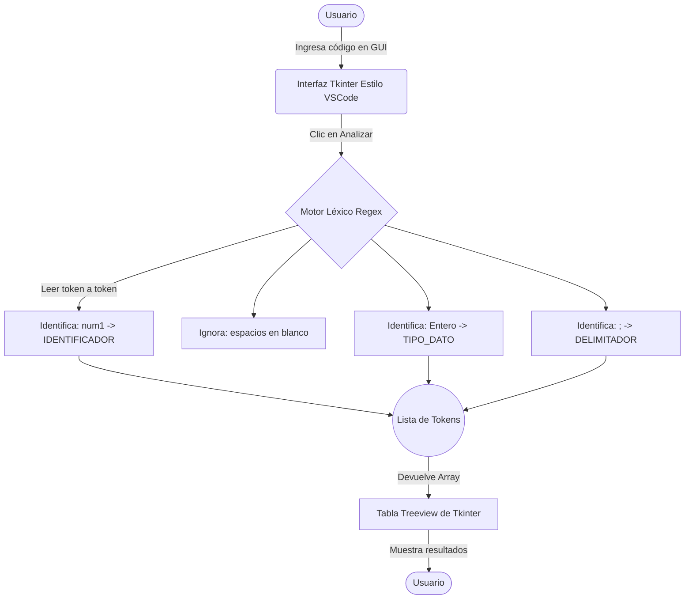

# Actividad Inicial: Analizador Léxico para "COSTEÑOL"

**Estudiantes:** Jhoan Acosta y Rafael Jimenez  
**Materia:** Compiladores Viernes Nocturno

## Objetivo
Realizar la primera parte del compilador: Descomponer en Tokens, de izquierda a derecha, todos los comandos de una línea de código del lenguaje propuesto (Costeñol).

## Herramientas
- **Lenguaje Base:** Python
- **Interfaz Gráfica:** Tkinter (Librería estándar de Python)
- **Librería de Procesamiento:** `re` (Expresiones Regulares nativas de Python)

## Funcionamiento del Analizador Léxico en Python

El analizador léxico tomará el código fuente escrito en el lenguaje **Costeñol** y lo agrupará en "Tokens" válidos definidos por las reglas del lenguaje.

Para lograr esto en Python, utilizaremos expresiones regulares (Regex) para identificar cada componente. 

### Especificación de Tokens (Costeñol)

Basados en las reglas del lenguaje, definiremos los siguientes tipos de tokens:

1.  **Tipos de Datos (Palabras Reservadas):** `Texto`, `Entero`, `Real`, `Logico`
2.  **Comandos de Lectura/Escritura (Palabras Reservadas):** `Captura`, `Mensaje`
    - **`Captura`**: Se utiliza para solicitar el ingreso de datos por parte del usuario. Funciona de manera análoga a un `input()` en Python o `scanf()` en C. Su formato es `Captura.<TipoDato>()`.
    - **`Mensaje`**: Se utiliza para mostrar o imprimir datos en la pantalla/consola. Es análogo a un `print()` en Python o `printf()` en C. Su formato es `Mensaje.Texto("<texto>")`.
3.  **Identificadores:** Nombres de variables (ej. `num1`, `nombre`, `asis`). Formados por letras y opcionalmente números.
4.  **Operadores:**
    - Asignación: `=`
    - Aritméticos: `+`, `-`, `*`, `/`
    - Separadores/Acceso: `.` (Punto para `Captura.Entero()`)
5.  **Delimitadores:**
    - Paréntesis: `(` y `)`
    - Fin de línea: `;`
6.  **Literales (Valores):**
    - Cadenas de Texto: Todo lo que esté entre comillas dobles `"Esto es una prueba"` o `"Alejandra"`.
    - Números Enteros: Secuencia de dígitos `10`, `50`.
    - Números Reales: Dígitos separados por coma `,` (ej. `3,1416`).

### Estructura de la Aplicación (Python + Tkinter)

El script constará de dos partes principales:

1.  **El Motor Léxico (`scanner`):**
    Una función en Python que recibe un string (línea de código), aplica una serie de patrones Regex predefinidos utilizando `re.finditer` o `re.match`, y devuelve una lista estructurada con los tokens encontrados, ignorando los espacios en blanco.

2.  **La Interfaz Gráfica (GUI - Estilo VSCode):**
    Una ventana creada con Tkinter diseñada para simular el entorno de Visual Studio Code (tema oscuro, áreas separadas). Contendrá:
    - Un campo de texto grande (`Text` widget) donde el usuario puede escribir su código en Costeñol.
    - Un botón "Analizar Léxicamente" (`Button` widget).
    - Un área de resultados, típicamente una tabla (`Treeview` de `tkinter.ttk`), donde se mostrará la salida del análisis. La tabla tendrá columnas para: `Línea`, `Token (Lexema)`, y `Tipo de Token`.

### Flujo de Ejecución (Script de la Actividad Inicial)

1. El usuario ingresa una línea de código como: `num1 Entero; nombre Texto;` en la ventana de Tkinter.
2. Al presionar "Analizar", Tkinter captura el texto y se lo pasa a la función del motor léxico.
3. El motor recorre el texto de izquierda a derecha. Encuentra `num1` y lo clasifica como `IDENTIFICADOR`. Luego encuentra `Entero` y lo clasifica como `TIPO_DATO`. Luego encuentra `;` y lo clasifica como `DELIMITADOR_FIN_LINEA`.
4. El motor léxico retorna la lista de tokens generada a Tkinter.
5. Tkinter toma esta lista y la renderiza fila por fila en la tabla visual de resultados, indicando claramente qué componente es cada palabra o símbolo de la línea evaluada.

*(El código fuente base en Python se desarrollará en los siguientes pasos del proyecto, usando esta arquitectura como plano principal).*

### Diagrama de Flujo del Analizador Léxico

Para entender mejor cómo se conectará la interfaz con la lógica del tokenizador, el siguiente diagrama muestra el flujo exacto de la "Actividad Inicial":

