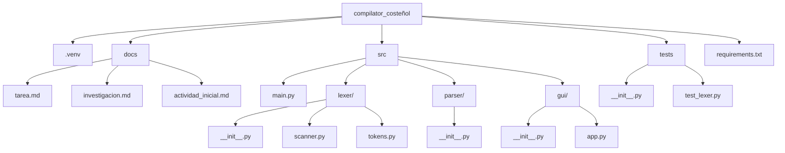
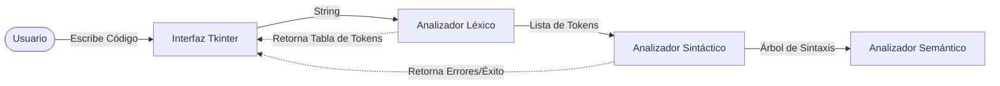
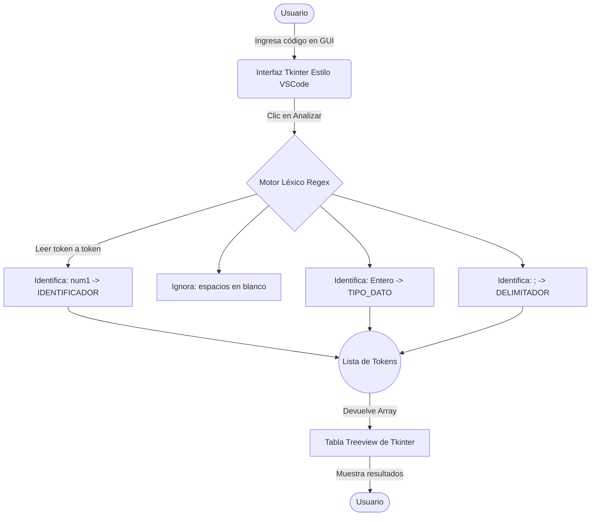

# Investigación de Compiladores y Planeación del Proyecto

**Estudiantes:** Jhoan Acosta y Rafael Jimenez  
**Materia:** Compiladores Viernes Nocturno
**Repositorio:** [https://github.com/Blazkull/compilator_coste-ol](https://github.com/Blazkull/compilator_coste-ol)

## 1. Referencias de trabajos realizados (Compiladores existentes)

Los compiladores son programas fundamentales en la informática, encargados de traducir código fuente escrito en un lenguaje de alto nivel a lenguaje máquina o código intermedio. A continuación, se referencian algunos de los compiladores más importantes y reconocidos:

- **GCC (GNU Compiler Collection):**
  - **Qué hace:** Es un conjunto de compiladores integrados del Proyecto GNU que soporta varios lenguajes como C, C++, Objective-C, Fortran, Ada, Go y D. Produce código máquina altamente optimizado para múltiples arquitecturas de hardware.
  - **Bajo qué software fue realizado:** Está escrito principalmente en C y C++. Es software libre bajo la licencia GPL.
- **Clang / LLVM:**
  - **Qué hace:** Clang es un front-end (analizador léxico, sintáctico y semántico) para lenguajes de la familia C (C, C++, Objective-C). Utiliza LLVM (Low Level Virtual Machine) como back-end para optimizar y generar el código máquina. Se destaca por sus mensajes de error más comprensibles y su rapidez de compilación.
  - **Bajo qué software fue realizado:** Escrito en C++.
- **Javac (Java Compiler):**
  - **Qué hace:** Es el compilador principal del lenguaje Java. A diferencia de GCC o Clang que compilan a código máquina nativo, Javac compila el código fuente de Java (`.java`) a un código intermedio llamado _bytecode_ (`.class`), el cual es interpretado y ejecutado por la Máquina Virtual de Java (JVM).
  - **Bajo qué software fue realizado:** Está escrito en el mismo lenguaje Java.
- **CPython:**
  - **Qué hace:** Es la implementación de referencia del lenguaje Python. Funciona compilando el código fuente Python a _bytecode_ de manera transparente, y luego una máquina virtual propia ejecuta ese bytecode.
  - **Bajo qué software fue realizado:** Escrito en C.

## 2. Software especializado para realizar compiladores

Para facilitar la creación de compiladores, existen herramientas conocidas como "Compiladores de compiladores" o generadores de analizadores. Estas herramientas automatizan la creación de las fases de análisis léxico y sintáctico a partir de una gramática formal.

- **Lex / Flex:** Herramientas para generar analizadores léxicos (scanners). Toman expresiones regulares y generan código en C que divide el texto en "tokens". (Flex es la versión libre y mejorada de Lex).
- **Yacc / Bison:** Generadores de analizadores sintácticos (parsers). Toman una gramática libre de contexto y generan el código en C que construye el árbol de sintaxis del código. (Bison es la versión libre de Yacc y se suele usar junto con Flex).
- **ANTLR (ANother Tool for Language Recognition):** Una poderosa herramienta que puede generar analizadores léxicos y sintácticos a partir de un solo archivo de gramática. Genera código en múltiples lenguajes como Java, C#, Python, JavaScript, entre otros.
- **PLY (Python Lex-Yacc):** Una implementación de las herramientas de análisis Lex y Yacc pero escritas puramente en Python. Es ideal si el compilador se va a desarrollar completamente en Python.

## 3. Definición del Lenguaje de Programación y Planeación

### Lenguaje Seleccionado

Para el desarrollo de nuestro compilador para el lenguaje **"COSTEÑOL"**, se utilizará **Python**. Python es un lenguaje altamente versátil con excelentes capacidades para el manejo y procesamiento de cadenas de texto (strings) e incorpora una potente librería de Expresiones Regulares (`re`), lo cual facilitará enormemente la construcción del analizador léxico.

Para la **interfaz gráfica**, se utilizará **Tkinter**, la biblioteca estándar de GUI para Python. Se diseñará con un tema oscuro (Dark Theme) emulando la apariencia de **Visual Studio Code (VSCode)**, incluyendo números de línea, resaltado de sintaxis simulado y un panel de consola inferior. Esto permitirá crear una interfaz amigable y profesional donde el usuario pueda ingresar el código fuente y ver el resultado de la tokenización, el análisis sintáctico y los posibles errores de manera visual.

### Planeación del Desarrollo

El desarrollo del compilador se dividirá en las siguientes fases:

1. **Fase 1: Análisis Léxico (Actividad Inicial):**
   - Definir los patrones (expresiones regulares) para todos los elementos del lenguaje Costeñol (Tipos de datos: Entero, Texto, Real, Logico, palabras reservadas como Captura, Mensaje, operadores, identificadores y símbolos de puntuación).
   - Desarrollar la interfaz gráfica en Tkinter con un área de texto para la entrada de código y una tabla o lista para mostrar los tokens generados.
2. **Fase 2: Análisis Sintáctico:**
   - Definir la gramática del lenguaje Costeñol (reglas de cómo se estructuran las declaraciones, asignaciones y llamadas a funciones).
   - Implementar el parser para validar la estructura del código basándose en los tokens generados en la Fase 1.
3. **Fase 3: Análisis Semántico:**
   - Verificar la coherencia de los tipos (ej: no asignar texto a una variable declarada como Entero).
4. **Fase 4: Integración y Pruebas:**
   - Unir todas las fases en la interfaz de Tkinter, asegurando que el flujo desde la escritura del código hasta el reporte de análisis sea continuo y robusto.

### Arquitectura y Estructura del Proyecto

A continuación, se detalla cómo quedará estructurado el proyecto a nivel de carpetas y el diagrama general de su arquitectura:

#### Estructura de Carpetas



- `.venv/`: Entorno virtual de Python para aislar dependencias.
- `docs/`: Almacena la documentación e investigación.
- `src/`: Código fuente principal del compilador modularizado.
  - `main.py`: Punto de entrada de la aplicación.
  - `lexer/`: Paquete para el Analizador Léxico (Actividad Inicial).
  - `parser/`: Paquete para el Analizador Sintáctico.
  - `gui/`: Paquete para la interfaz gráfica (Tema VSCode).
- `tests/`: Scripts para realizar pruebas automatizadas y evaluar combinaciones de entrada.
- `requirements.txt`: Archivo para gestionar las dependencias del proyecto.

#### Arquitectura General del Compilador



---

# Actividad Inicial: Analizador Léxico para "COSTEÑOL"

## Objetivo

Realizar la primera parte del compilador: Descomponer en Tokens, de izquierda a derecha, todos los comandos de una línea de código del lenguaje propuesto (Costeñol).

## Herramientas

- **Lenguaje Base:** Python
- **Interfaz Gráfica:** Tkinter (Librería estándar de Python)
- **Librería de Procesamiento:** `re` (Expresiones Regulares nativas de Python)

## Funcionamiento del Analizador Léxico en Python

El analizador léxico tomará el código fuente escrito en el lenguaje **Costeñol** y lo agrupará en "Tokens" válidos definidos por las reglas del lenguaje.

Para lograr esto en Python, utilizaremos expresiones regulares (Regex) para identificar cada componente.

### Especificación de Tokens (Costeñol)

Basados en las reglas del lenguaje, definiremos los siguientes tipos de tokens:

1.  **Tipos de Datos (Palabras Reservadas):** `Texto`, `Entero`, `Real`, `Logico`
2.  **Comandos de Lectura/Escritura (Palabras Reservadas):** `Captura`, `Mensaje`
    - **`Captura`**: Se utiliza para solicitar el ingreso de datos por parte del usuario. Funciona de manera análoga a un `input()` en Python o `scanf()` en C. Su formato es `Captura.<TipoDato>()`.
    - **`Mensaje`**: Se utiliza para mostrar o imprimir datos en la pantalla/consola. Es análogo a un `print()` en Python o `printf()` en C. Su formato es `Mensaje.Texto("<texto>")`.
3.  **Identificadores:** Nombres de variables (ej. `num1`, `nombre`, `asis`). Formados por letras y opcionalmente números.
4.  **Operadores:**
    - Asignación: `=`
    - Aritméticos: `+`, `-`, `*`, `/`
    - Separadores/Acceso: `.` (Punto para `Captura.Entero()`)
5.  **Delimitadores:**
    - Paréntesis: `(` y `)`
    - Fin de línea: `;`
6.  **Literales (Valores):**
    - Cadenas de Texto: Todo lo que esté entre comillas dobles `"Esto es una prueba"` o `"Alejandra"`.
    - Números Enteros: Secuencia de dígitos `10`, `50`.
    - Números Reales: Dígitos separados por coma `,` (ej. `3,1416`).

### Estructura de la Aplicación (Python + Tkinter)

El script constará de dos partes principales:

1.  **El Motor Léxico (`scanner`):**
    Una función en Python que recibe un string (línea de código), aplica una serie de patrones Regex predefinidos utilizando `re.finditer` o `re.match`, y devuelve una lista estructurada con los tokens encontrados, ignorando los espacios en blanco.

2.  **La Interfaz Gráfica (GUI - Estilo VSCode):**
    Una ventana creada con Tkinter diseñada para simular el entorno de Visual Studio Code (tema oscuro, áreas separadas). Contendrá:
    - Un campo de texto grande (`Text` widget) donde el usuario puede escribir su código en Costeñol.
    - Un botón "Analizar Léxicamente" (`Button` widget).
    - Un área de resultados, típicamente una tabla (`Treeview` de `tkinter.ttk`), donde se mostrará la salida del análisis. La tabla tendrá columnas para: `Línea`, `Token (Lexema)`, y `Tipo de Token`.

### Flujo de Ejecución (Script de la Actividad Inicial)

1. El usuario ingresa una línea de código como: `num1 Entero; nombre Texto;` en la ventana de Tkinter.
2. Al presionar "Analizar", Tkinter captura el texto y se lo pasa a la función del motor léxico.
3. El motor recorre el texto de izquierda a derecha. Encuentra `num1` y lo clasifica como `IDENTIFICADOR`. Luego encuentra `Entero` y lo clasifica como `TIPO_DATO`. Luego encuentra `;` y lo clasifica como `DELIMITADOR_FIN_LINEA`.
4. El motor léxico retorna la lista de tokens generada a Tkinter.
5. Tkinter toma esta lista y la renderiza fila por fila en la tabla visual de resultados, indicando claramente qué componente es cada palabra o símbolo de la línea evaluada.

### Diagrama de Flujo del Analizador Léxico

Para entender mejor cómo se conectará la interfaz con la lógica del tokenizador, el siguiente diagrama muestra el flujo exacto de la "Actividad Inicial":



---

## 4. Implementación del Script de Descomposición de Tokens

Para llevar a cabo el Análisis Léxico (o Escáner), investigamos y estructuramos un script en Python que nos permitiera identificar y clasificar cada componente del código fuente. A continuación, detallamos el proceso lógico y las herramientas utilizadas para lograr esta descomposición de tokens.

### 4.1 Definición de Expresiones Regulares (`tokens.py`)
Nos apoyamos fuertemente en la librería estándar `re` de Python, la cual es fundamental para el procesamiento de texto avanzado. Construimos un diccionario maestro de expresiones regulares con las siguientes reglas para nuestro lenguaje:

*   **TIPO_DATO:** `\b(Texto|Entero|Real|Logico)\b`
*   **COMANDO_IO:** `\b(Captura|Mensaje)\b`
*   **NUMERO_REAL:** `\d+,\d+` (Exige el uso de coma).
*   **NUMERO_ENTERO:** `\d+`
*   **CADENA_TEXTO:** `"[^"]*"`
*   **IDENTIFICADOR:** `[a-zA-Z_]\w*`
*   **OPERADOR_ASIGNACION:** `=`
*   **OPERADOR_ARITMETICO:** `[+\-*/]`
*   **PARENTESIS_ABRE / CIERRA:** `\(` y `\)`
*   **DELIMITADOR_FIN:** `;`
*   **SEPARADOR:** `\.`
*   **ESPACIOS:** `\s+` (Se capturan pero se ignoran en el listado final).

Decidimos unificar estas reglas en un **Regex Maestro** aprovechando el formato de grupos nombrados de Python `(?P<Nombre>Patron)`. Esta técnica nos pareció la más óptima ya que permite analizar el texto en una sola pasada, aumentando notablemente el rendimiento.

### 4.2 Motor de Tokenización (`scanner.py`)
Implementamos el método central `tokenize(code)`, el cual recorre la cadena de código de izquierda a derecha. Su funcionamiento se basa en un ciclo `while` y la función `match()` de Regex.

1.  El motor intenta hacer "match" del texto en la posición actual contra el Regex Maestro.
2.  Si coincide con `ESPACIOS`, avanzamos la posición internamente y actualizamos el conteo de saltos de línea para no perder el rastro de la ubicación.
3.  Si coincide con cualquier otra regla, instanciamos un objeto **Token** que guarda el Tipo, Valor (Lexema), Línea y Columna.
4.  **Manejo de Errores:** Si encontramos un carácter extraño (como un `@` o `&`), el proceso se detiene lanzando una excepción `LexicalError`. Esto nos garantiza que el lenguaje se mantenga estricto y limpio desde el principio.

A continuación, presentamos el bloque de código principal en Python que ilustra esta lógica de descomposición utilizando la librería `re`:

```python
import re

# Unificación de reglas en un Regex Maestro
PATRONES = [
    ('TIPO_DATO', r'\b(Entero|Real|Texto|Logico)\b'),
    ('COMANDO_IO', r'\b(Captura|Mensaje)\b'),
    ('NUMERO_REAL', r'\d+,\d+'),
    ('NUMERO_ENTERO', r'\d+'),
    ('CADENA_TEXTO', r'"[^"]*"'),
    ('IDENTIFICADOR', r'[a-zA-Z_][a-zA-Z0-9_]*'),
    ('OPERADOR_ASIGNACION', r'='),
    ('OPERADOR_ARITMETICO', r'[+\-*/]'),
    ('PARENTESIS_ABRE', r'\('),
    ('PARENTESIS_CIERRA', r'\)'),
    ('DELIMITADOR_FIN', r';'),
    ('SEPARADOR', r'\.'),
    ('ESPACIOS', r'\s+')
]

# Construcción de la expresión regular compilada
regex_parts = []
for name, pattern in PATRONES:
    regex_parts.append(f'(?P<{name}>{pattern})')
MASTER_REGEX = re.compile('|'.join(regex_parts))

def tokenize(code: str):
    tokens = []
    line_num = 1
    line_start = 0
    position = 0
    length = len(code)
    
    while position < length:
        match = MASTER_REGEX.match(code, position)
        if match:
            type_name = match.lastgroup
            value = match.group(type_name)
            column = position - line_start + 1
            
            if type_name != 'ESPACIOS':
                tokens.append({'tipo': type_name, 'valor': value, 'linea': line_num, 'columna': column})
            elif '\n' in value:
                line_num += value.count('\n')
                line_start = position + value.rfind('\n') + 1
                
            position = match.end()
        else:
            raise Exception(f"Error Léxico: Carácter ilegal en la línea {line_num}")
            
    return tokens
```

### 4.3 Pruebas Automatizadas
Como parte de las buenas prácticas en la investigación y desarrollo del compilador, elaboramos pruebas unitarias (`unittest`) para someter al escáner a diferentes escenarios:
*   Declaraciones y asignaciones simples (`num1 Entero;`).
*   Operaciones complejas con múltiples componentes.
*   Rechazo estricto de caracteres inválidos.

Con esto logramos certificar que nuestra base léxica es sólida antes de continuar con la siguiente fase.
