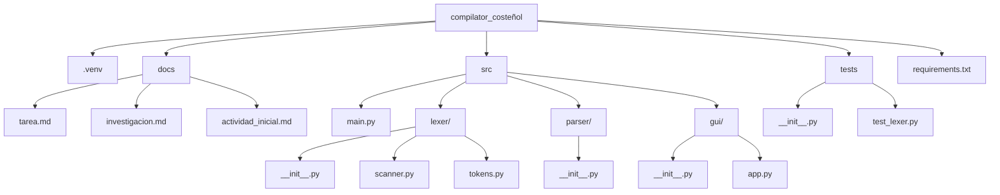
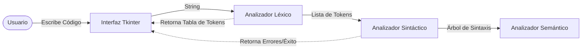

# Investigación de Compiladores y Planeación del Proyecto

**Estudiantes:** Jhoan Acosta y Rafael Jimenez  
**Materia:** Compiladores Viernes Nocturno

## 1. Referencias de trabajos realizados (Compiladores existentes)

Los compiladores son programas fundamentales en la informática, encargados de traducir código fuente escrito en un lenguaje de alto nivel a lenguaje máquina o código intermedio. A continuación, se referencian algunos de los compiladores más importantes y reconocidos:

- **GCC (GNU Compiler Collection):**
  - **Qué hace:** Es un conjunto de compiladores integrados del Proyecto GNU que soporta varios lenguajes como C, C++, Objective-C, Fortran, Ada, Go y D. Produce código máquina altamente optimizado para múltiples arquitecturas de hardware.
  - **Bajo qué software fue realizado:** Está escrito principalmente en C y C++. Es software libre bajo la licencia GPL.
- **Clang / LLVM:**
  - **Qué hace:** Clang es un front-end (analizador léxico, sintáctico y semántico) para lenguajes de la familia C (C, C++, Objective-C). Utiliza LLVM (Low Level Virtual Machine) como back-end para optimizar y generar el código máquina. Se destaca por sus mensajes de error más comprensibles y su rapidez de compilación.
  - **Bajo qué software fue realizado:** Escrito en C++.
- **Javac (Java Compiler):**
  - **Qué hace:** Es el compilador principal del lenguaje Java. A diferencia de GCC o Clang que compilan a código máquina nativo, Javac compila el código fuente de Java (`.java`) a un código intermedio llamado _bytecode_ (`.class`), el cual es interpretado y ejecutado por la Máquina Virtual de Java (JVM).
  - **Bajo qué software fue realizado:** Está escrito en el mismo lenguaje Java.
- **CPython:**
  - **Qué hace:** Es la implementación de referencia del lenguaje Python. Funciona compilando el código fuente Python a _bytecode_ de manera transparente, y luego una máquina virtual propia ejecuta ese bytecode.
  - **Bajo qué software fue realizado:** Escrito en C.

## 2. Software especializado para realizar compiladores

Para facilitar la creación de compiladores, existen herramientas conocidas como "Compiladores de compiladores" o generadores de analizadores. Estas herramientas automatizan la creación de las fases de análisis léxico y sintáctico a partir de una gramática formal.

- **Lex / Flex:** Herramientas para generar analizadores léxicos (scanners). Toman expresiones regulares y generan código en C que divide el texto en "tokens". (Flex es la versión libre y mejorada de Lex).
- **Yacc / Bison:** Generadores de analizadores sintácticos (parsers). Toman una gramática libre de contexto y generan el código en C que construye el árbol de sintaxis del código. (Bison es la versión libre de Yacc y se suele usar junto con Flex).
- **ANTLR (ANother Tool for Language Recognition):** Una poderosa herramienta que puede generar analizadores léxicos y sintácticos a partir de un solo archivo de gramática. Genera código en múltiples lenguajes como Java, C#, Python, JavaScript, entre otros.
- **PLY (Python Lex-Yacc):** Una implementación de las herramientas de análisis Lex y Yacc pero escritas puramente en Python. Es ideal si el compilador se va a desarrollar completamente en Python.

## 3. Definición del Lenguaje de Programación y Planeación

### Lenguaje Seleccionado

Para el desarrollo de nuestro compilador para el lenguaje **"COSTEÑOL"**, se utilizará **Python**. Python es un lenguaje altamente versátil con excelentes capacidades para el manejo y procesamiento de cadenas de texto (strings) e incorpora una potente librería de Expresiones Regulares (`re`), lo cual facilitará enormemente la construcción del analizador léxico.

Para la **interfaz gráfica**, se utilizará **Tkinter**, la biblioteca estándar de GUI para Python. Se diseñará con un tema oscuro (Dark Theme) emulando la apariencia de **Visual Studio Code (VSCode)**, incluyendo números de línea, resaltado de sintaxis simulado y un panel de consola inferior. Esto permitirá crear una interfaz amigable y profesional donde el usuario pueda ingresar el código fuente y ver el resultado de la tokenización, el análisis sintáctico y los posibles errores de manera visual.

### Planeación del Desarrollo

El desarrollo del compilador se dividirá en las siguientes fases:

1. **Fase 1: Análisis Léxico (Actividad Inicial):**
   - Definir los patrones (expresiones regulares) para todos los elementos del lenguaje Costeñol (Tipos de datos: Entero, Texto, Real, Logico, palabras reservadas como Captura, Mensaje, operadores, identificadores y símbolos de puntuación).
   - Desarrollar la interfaz gráfica en Tkinter con un área de texto para la entrada de código y una tabla o lista para mostrar los tokens generados.
2. **Fase 2: Análisis Sintáctico:**
   - Definir la gramática del lenguaje Costeñol (reglas de cómo se estructuran las declaraciones, asignaciones y llamadas a funciones).
   - Implementar el parser para validar la estructura del código basándose en los tokens generados en la Fase 1.
3. **Fase 3: Análisis Semántico:**
   - Verificar la coherencia de los tipos (ej: no asignar texto a una variable declarada como Entero).
4. **Fase 4: Integración y Pruebas:**
   - Unir todas las fases en la interfaz de Tkinter, asegurando que el flujo desde la escritura del código hasta el reporte de análisis sea continuo y robusto.

### Arquitectura y Estructura del Proyecto

A continuación, se detalla cómo quedará estructurado el proyecto a nivel de carpetas y el diagrama general de su arquitectura:

#### Estructura de Carpetas

- `.venv/`: Entorno virtual de Python para aislar dependencias.
- `docs/`: Almacena la documentación e investigación.
- `src/`: Código fuente principal del compilador modularizado.
  - `main.py`: Punto de entrada de la aplicación.
  - `lexer/`: Paquete para el Analizador Léxico (Actividad Inicial).
  - `parser/`: Paquete para el Analizador Sintáctico.
  - `gui/`: Paquete para la interfaz gráfica (Tema VSCode).
- `tests/`: Scripts para realizar pruebas automatizadas y evaluar combinaciones de entrada.
- `requirements.txt`: Archivo para gestionar las dependencias del proyecto.

#### Arquitectura General del Compilador

